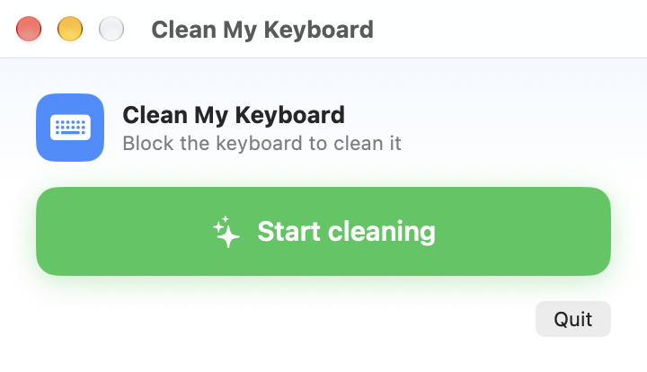

# Clean My Keyboard

A native macOS utility for cleaning your keyboard. Flip one switch and every key press is
ignored until you flip it back, so you can wipe the keyboard without typing anything.

## Compatibility

The app is built and verified on **macOS 27**, and targets macOS 13.0 or later, so it runs
on macOS 13 through macOS 27. It is a universal binary (Apple silicon and Intel).

Because it works by intercepting keyboard events, it depends only on the Accessibility API, which
is stable across these releases. If a future macOS update changes the privacy or event-tap behavior
and the switch stops blocking, please open an issue with your macOS version.

## Download

Grab the latest `CleanMyKeyboard-<version>.dmg` from the
[Releases](https://github.com/mobbjelly/clean-my-keyboard/releases) page, open it, and drag
**Clean My Keyboard** into **Applications**. The build is signed ad-hoc and is not notarized, so
on first launch macOS may warn about an unidentified developer: right-click the app and choose
**Open**, or allow it from System Settings -> Privacy & Security.

## Features

- One-click toggle: while cleaning, every keyboard event is swallowed by a CGEventTap at the
  session level (key down, key up, modifier changes, and system keys such as media and brightness).
- No bypass: while cleaning, every keystroke is blocked with no keyboard shortcut to get through.
  Mouse input is untouched, so the on-screen button and the menu bar item always work.
- Menu bar item: toggle the switch from the menu bar at any time; closing the main window keeps
  the app running.

## Build and run

Requires the Xcode command line tools (`swiftc`).

    make setup-signing   # one-time: create the local signing identity
    make run             # build and launch the app
    make build           # build only; output in build/Clean My Keyboard.app
    make dmg             # build and package a distributable disk image
    make clean           # remove build output

The build script compiles arm64 and x86_64, merges them into a universal binary, generates the app
icon, and signs the bundle with the local identity (falling back to ad-hoc signing if the identity
has not been created yet).

## Why permissions used to be lost on every rebuild

An ad-hoc signature has no certificate, so macOS identifies the app by a hash of the executable
(its `cdhash`). That hash includes the contents of `Info.plist`, which changes on every build, so
each rebuild looked like a completely different app: the Accessibility permission was tied to the
old hash and the new build had to ask again. The stale entry you may see enabled in System Settings
is the orphaned old build.

The fix is to sign with a stable identity. `make setup-signing` creates a local self-signed
certificate once, and the build script then signs with it. The app's identity becomes
`identifier "com.jinhua.cleanmykeyboard" and certificate root = ...` instead of a file hash, so it
stays the same across rebuilds and the Accessibility permission is kept.

If macOS still shows an old disabled entry for the app, remove it once from System Settings ->
Privacy & Security -> Accessibility, then add the current app and click Recheck in the window.

## Granting permission

macOS does not let a normal app intercept keyboard events. On the first toggle the app asks for
permission:

1. Click **Request** in the window, or open System Settings -> Privacy & Security -> Accessibility.
2. Turn on **Clean My Keyboard**. If you launched it from a terminal with `make run`, you may need to
   enable the terminal there instead.
3. Return to the app and click the switch again.

## Notes

- While blocking, system shortcuts such as Command-Q and Command-W are intercepted too. Use the
  Quit button in the window or the menu bar to exit.
- macOS "secure input" (for example a password prompt in Terminal) disables event taps, so blocking
  stops working during those prompts.
- Unplug external keyboards before cleaning; the app blocks the built-in keyboard and every
  connected keyboard alike.
- This app is not notarized by Apple. If Gatekeeper blocks it, right-click the app and choose **Open**.

## Contributing

Issues and pull requests are welcome. To build from source:

    git clone https://github.com/mobbjelly/clean-my-keyboard.git
    cd clean-my-keyboard
    make setup-signing
    make run

## License

Released under the [MIT License](LICENSE).
